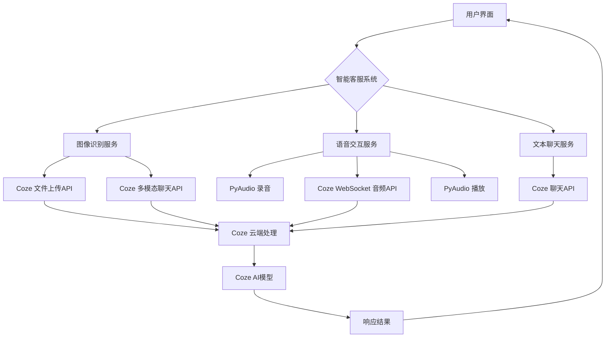

# 智能客服系统架构

## 系统架构图

## 组件说明

### 1. 用户界面 (main.py)
- 提供命令行交互界面
- 显示菜单和服务选项
- 处理用户输入和系统输出

### 2. 图像识别服务 (image_service.py)
- 处理图像文件上传
- 调用Coze多模态聊天API进行图像分析
- 支持多种图像处理功能：
  - 图像内容描述
  - 文字提取
  - 自定义问题回答

### 3. 语音交互服务 (audio_service.py)
- 实时音频录制和播放
- 通过WebSocket与Coze API通信
- 支持流式语音对话

### 4. 文本聊天服务
- 传统的文本对话模式
- 通过Coze聊天API处理文本输入

### 5. 配置管理 (config.py)
- 管理API密钥和配置参数
- 提供环境变量访问接口

## 数据流向

1. **图像识别流程**：
   用户提供图像 → 图像服务上传文件 → 调用多模态聊天API → 返回分析结果

2. **语音交互流程**：
   用户语音输入 → PyAudio录制 → WebSocket发送音频 → Coze处理 → WebSocket接收回复 → PyAudio播放

3. **文本聊天流程**：
   用户文本输入 → 调用聊天API → 返回文本回复

## 依赖关系

- **Coze Python SDK**：与Coze平台通信
- **PyAudio**：处理音频录制和播放
- **标准库**：os, sys, pathlib, asyncio等