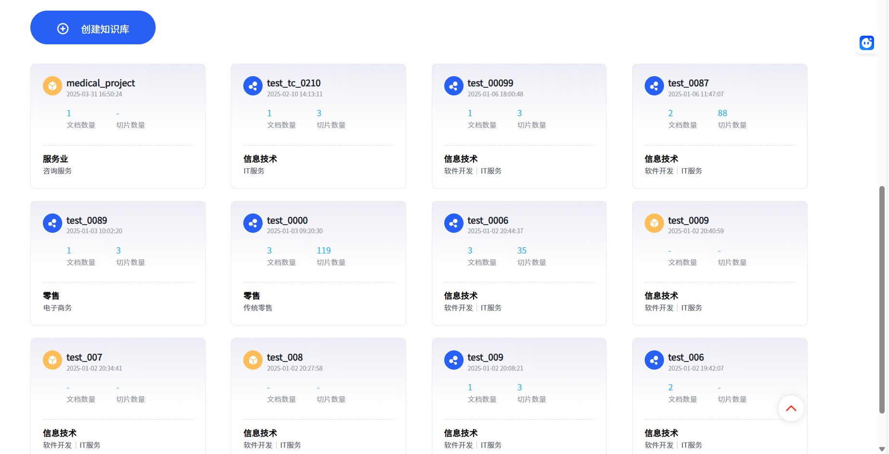

# RAG 知识检索系统

一个基于向量数据库和知识图谱的检索增强生成（RAG）系统，支持结构化数据和非结构化数据的知识检索与生成。

## 📋 项目简介

本项目实现了一个完整的RAG知识库系统，主要功能包括：

- **向量检索**：基于混合检索（语义检索+TF-IDF）的智能问答
- **知识图谱**：自动提取实体关系并构建知识图谱
- **多模态支持**：支持文本和图像的混合输入
- **知识库管理**：完整的知识库CRUD操作

## 🏗️ 架构设计

### 核心模块

```
RAG项目
├── 向量检索模块
│   ├── kg_search.py              # 基础检索
│   ├── kg_search_knowledge.py    # 知识检索（带预/后处理）
│   ├── kg_search_and_generate.py # 检索+生成一体化
│   ├── kg_Rerank.py              # 重排序
│   └── 混合检索.py               # 语义检索+TF-IDF混合
│
├── 知识库管理模块
│   ├── kg_create.py              # 创建知识库
│   ├── kg_create_unstructured.py # 创建非结构化知识库
│   ├── kg_list.py                # 列出知识库
│   ├── kg_info.py                # 知识库信息
│   ├── kg_update.py              # 更新知识库
│   └── kg_delete.py              # 删除知识库
│
├── 文档管理模块
│   ├── doc_add.py                # 添加文档
│   ├── doc_list.py               # 列出文档
│   ├── doc_info.py               # 文档信息
│   ├── doc_update_meta.py        # 更新文档元数据
│   └── doc_delete.py             # 删除文档
│
├── 知识图谱模块
│   ├── graphRAG知识图谱构建.py   # 图谱构建主流程
│   ├── kg_chat_completions.py    # 图谱辅助对话
│   ├── 知识图谱2.py              # 图谱工具
│   └── relation_entity_insert.py # 实体关系插入
│
├── Prompt管理模块
│   ├── RAG_prompts.py            # RAG相关prompts
│   └── prompts_mangement.py      # Prompt模板管理
│
├── 工具模块
│   ├── utils.py                  # 签名和请求工具
│   ├── logger.py                 # 日志工具
│   └── doubao.py                 # Doubao API调用
│
└── Web服务模块
    └── app.py                    # Flask API服务
```





## 🚀 快速开始

### 环境要求

- Python 3.8+
- 火山引擎 API 密钥

### 安装依赖

```bash
pip install flask requests numpy jieba dashscope volcengine-python-sdk
```

### 配置

在 `utils.py` 中配置您的火山引擎 API 密钥：

```python
ak = 'your_access_key'
sk = 'your_secret_key'
```

### 运行示例

#### 1. 创建知识库

```bash
python kg_create.py
```

#### 2. 添加文档

```bash
python doc_add.py
```

#### 3. 搜索知识

```bash
python kg_search_knowledge.py
```

#### 4. 启动Web服务

```bash
python app.py
```

## 🔍 核心功能

### 1. 向量检索

支持两种检索模式：

- **混合检索**：结合语义相似度（Embedding）和TF-IDF相似度
- **重排序**：使用Doubao重排序模型提升检索精度

```python
# 示例：混合检索
from 混合检索 import calculate_final_score

semantic_score = calculate_similarity(query, document)
tfidf_score = calculate_tfidf_similarity(query, document)
final_score = calculate_final_score(semantic_score, tfidf_score, w1=0.8, w2=0.2)
```

### 2. 知识图谱构建

自动从文本中提取实体和关系，构建知识图谱：

**流程图：**

1. 提取实体 → 2. 总结实体 → 3. 构建关系 → 4. 去重清洗 → 5. 生成节点 → 6. 构建图谱

```python
# 示例：构建知识图谱
from doubao import create_base_extracted_entities, create_summarized_entities

entities = create_base_extracted_entities(text)
summarized = create_summarized_entities(entities)
# ... 继续构建图谱
```

### 3. 检索增强生成 (RAG)

完整的RAG流程：

```python
request_params = {
    "name": "knowledge_base_name",
    "query": "用户问题",
    "retrieve_param": {
        "rerank_switch": True,
        "dense_weight": 0.7
    },
    "llm_param": {
        "model": "Doubao-pro-32k",
        "prompt": "你是一位智能助手..."
    }
}
```

## 🛠️ API接口

### Web API (Flask)

#### 创建知识库

```
POST /create_collection
{
    "name": "知识库名称",
    "description": "描述",
    "data_type": 0  # 0: 结构化, 1: 非结构化
}
```

#### 添加文档

```
POST /doc_add
{
    "name": "知识库名称",
    "doc_id": "文档ID",
    "doc_name": "文档名",
    "doc_type": "文档类型",
    "url": "文档URL"
}
```

## 📊 数据结构

### 结构化数据

- **字段配置**：问题、答案
- **索引类型**：hnsw_hybrid
- **嵌入模型**：doubao-embedding-and-m3

### 非结构化数据

- **分块策略**：custom_balance
- **分块长度**：500
- **多模态**：支持image_ocr

## 🔧 配置说明

### 索引配置

```python
index_config = {
    "quant": "int8",                    # 量化方式
    "cpu_quota": 1,                     # CPU配额
    "embedding_model": "doubao-embedding-and-m3",
    "embedding_dimension": 2048         # 向量维度
}
```

### 预处理配置

```python
preprocessing = {
    "chunking_strategy": "custom_balance",
    "chunk_length": 500,
    "multi_modal": ["image_ocr"]
}
```

## 📝 示例代码

### 完整RAG流程

```python
from kg_search_and_generate import *

# 1. 检索知识
result = search_knowledge(collection_name, query)

# 2. 生成回答
response = generate_answer(context, query)
```

### 三元组提取

```python
# 从文本中提取(主体, 谓词, 宾语)三元组
triplets = extract_triplets(text)
```

## 🎯 使用场景

1. **智能客服**：基于知识库的自动问答
2. **文档检索**：企业文档智能检索
3. **知识管理**：自动构建知识图谱
4. **内容生成**：基于检索的内容创作

## 📈 性能优化

- 使用int8量化减少存储
- HNSW索引加速检索
- 混合检索提升准确性
- 重排序优化结果质量

## 
